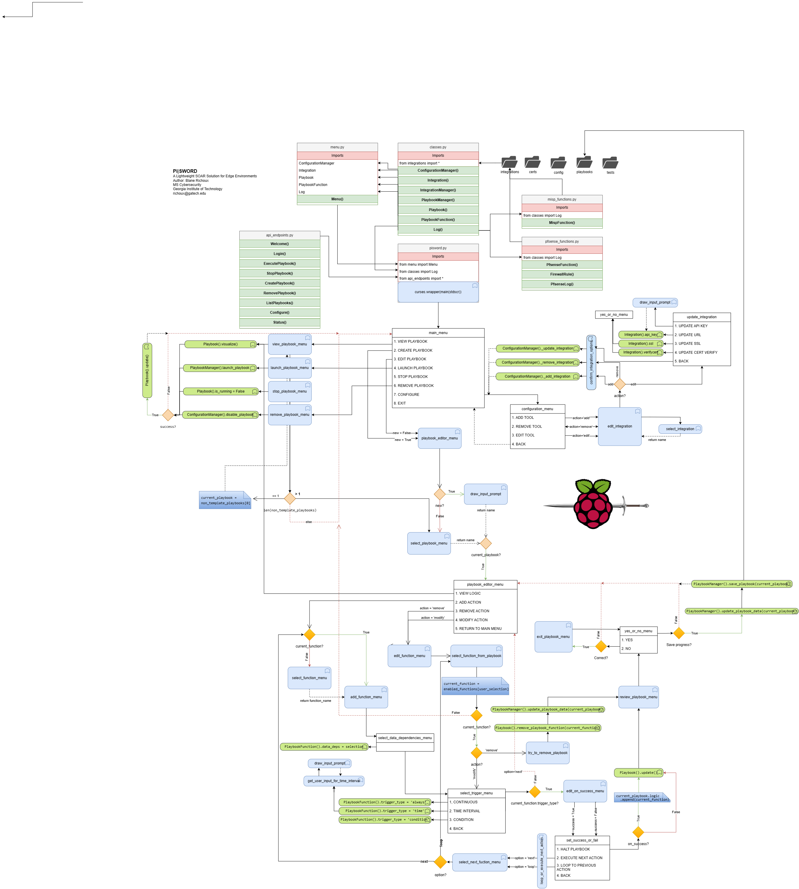

# Pi|SWORD
*A Python-based SOAR Platform Lightweight enough for any Environment*

## Description
_*Pi|SWORD*_ is a **SOAR** _(Security Orchestration, Automation, and Response)_ application and integration framework that is 
purpose-built to run efficiently in edge or small-office/home-office environments, such as on a Raspberry Pi
- The application reads YAML configuration files from the `./config` directory, and then executes the actions specified in the YAML files. 
- Once a playbook is launch, and will run continuously until stopped. It is designed to run statelessly, meaning that it 
does not need to store any data between runs, and reads the local configuration files and playbooks at launch.
- Features a `curses`-based menu system for creating, editing, and launching playbooks

## Proof of Concept Feaures
- The application will read a YAML file from the `./config` directory, and then execute the actions
- The application will extract threat intelligence blacklist IP data using `PyMISP`
- The application will interact with the remote APIs (integrations) as specified in the config files 
- The application will log all actions and results to a log file, `pisword.log`

## Future Features
- Containerize the application using Docker
- Graphical playbook visualization system
- Encrypt the API keys and other sensitive data using a master key
- Support for additional integrations
- A fully featured API for integrating with other applications
- A more user friendly web interface for configuring and using the application
- An automated installer for the application and dependencies

## Known Issues
- The menu system is not fully functional
- Not all of the playbook functions will work together
- The application is not fully tested

## Usage
- Run the application by executing the following command:
```bash
# Tested using Python 3.9.7 on Debian 11 (Bullseye)
$ python pisword.py
```


## Program Logic


# Pi|SWORD Install and Configuration
## Installing the operating system
- Install the latest version of Raspbian on your Raspberry Pi or Virtual Machine from the [Raspberry Pi Foundation Site](https://www.raspberrypi.org/downloads/raspbian/).
- Once the installation is complete, update the system by running the following commands:
```bash
sudo apt update -y
sudo apt upgrade -y
```
## Install Optional packages
- Install any additional desired packages by running the following command:
```bash
# Install optional packages
sudo apt-get install vim locate virtualenv -y

# Install Visual Studio Code (Optional)
sudo apt-get install code -y

# Install VMWare Tools (Optional, VMWare Only)
sudo mount /dev/cdrom
mkdir -p ~/Downloads/vmware-tools
cp -r /media/cdrom0/ ~/Downloads/vmware-tools
tar xvzf VMwareTools-*.tar.gz
cd vmware-tools-distrib
sudo apt-get install --no-install-recommends libglib2.0-0
sudo apt-get install --no-install-recommends build-essential
sudo apt-get install gcc-4.3 linux-headers-$(uname -r)
sudo ./vmware-install.pl 
```
If you get an error about not being able to run the configuration script, launch it manually by running the following command:
```bash
sudo /usr/bin/vmware-config-tools.pl
```

## Configure required services (Optional)
- Configure the SSH service by running the following command:
```bash
sudo vi /etc/ssh/sshd_config
# Uncomment the following lines:
PasswordAuthentication yes
PubkeyAuthentication yes
# Save and exit the file

# To enable the ssh server to start on boot, run the following command:
sudo systemctl enable --now ssh
```

## Install docker
- If you are using a Raspberry Pi, you will need to install docker manually by running the following commands:
```bash
# Uninstall old versions of docker
for pkg in docker.io docker-doc docker-compose podman-docker containerd runc; do sudo apt-get remove $pkg; done

# Raspberry Pi Install Only:
## Add Docker’s official GPG key (Raspberry Pi ):
sudo apt-get update
sudo apt-get install ca-certificates curl gnupg
sudo install -m 0755 -d /etc/apt/keyrings
curl -fsSL https://download.docker.com/linux/raspbian/gpg | sudo gpg --dearmor -o /etc/apt/keyrings/docker.gpg
sudo chmod a+r /etc/apt/keyrings/docker.gpg

## Setup Docker's Apt repository (Raspberry Pi Only):
echo \
  "deb [arch="$(dpkg --print-architecture)" signed-by=/etc/apt/keyrings/docker.gpg] https://download.docker.com/linux/raspbian \
  "$(. /etc/os-release && echo "$VERSION_CODENAME")" stable" | \
  sudo tee /etc/apt/sources.list.d/docker.list > /dev/null
sudo apt-get update

# Virtualized Raspberry Pi OS Install Only:
## Add Docker's official GPG key:
sudo apt-get update
sudo apt-get install ca-certificates curl gnupg
sudo install -m 0755 -d /etc/apt/keyrings
curl -fsSL https://download.docker.com/linux/debian/gpg | sudo gpg --dearmor -o /etc/apt/keyrings/docker.gpg
sudo chmod a+r /etc/apt/keyrings/docker.gpg

## Add the repository to Apt sources:
### NOTE: If you receive an error about 'i386' during this step, use 'amd64' as the architecture
echo \
  "deb [arch="$(dpkg --print-architecture)" signed-by=/etc/apt/keyrings/docker.gpg] https://download.docker.com/linux/debian \
  "$(. /etc/os-release && echo "$VERSION_CODENAME")" stable" | \
  sudo tee /etc/apt/sources.list.d/docker.list > /dev/null
sudo apt-get update


# Install the latest Docker packages:
sudo apt-get install docker-ce docker-ce-cli containerd.io docker-buildx-plugin docker-compose-plugin -y

# Verify the installation:
sudo docker run hello-world

# Verify docker-compose is in path
which docker-compose
## If not, run the following command
sudo ln -s /usr/libexec/docker/cli-plugins/docker-compose /usr/local/bin/docker-compose
```
References:
- [Docker Install Instructions - Virtualized Raspberry Pi](https://docs.docker.com/engine/install/debian/)
- [Docker Install Instructions - Raspberry Pi](https://docs.docker.com/engine/install/raspberry-pi-os/)

## Install MISP 
### TAU Docker MISP Install Instructions
- [Reference documentation](https://github.com/ostefano/docker-misp)
- Fetch install the latest version from their github page:
```bash
git clone https://github.com/ostefano/docker-misp.git
cd docker-misp
# Copy template.env to .env (on the root directory) and edit the environment variables at .env file
cp template.env .env
vi .env  # Change default passwords and other settings as desired
...
##
# Build-time variables
##

MISP_TAG=v2.4.177
MODULES_TAG=v2.4.176
PHP_VER=20190902
LIBFAUP_COMMIT=3a26d0a

PYPI_REDIS_VERSION="==5.0.*"
PYPI_LIEF_VERSION=">=0.13.1"
PYPI_PYDEEP2_VERSION="==0.5.*"
PYPI_PYTHON_MAGIC_VERSION="==0.4.*"
PYPI_MISP_LIB_STIX2_VERSION="==3.0.*"
PYPI_MAEC_VERSION="==4.1.*"
PYPI_MIXBOX_VERSION="==1.0.*"
PYPI_CYBOX_VERSION="==2.1.*"
PYPI_PYMISP_VERSION="==2.4.176"

# MISP_COMMIT takes precedence over MISP_TAG
# MISP_COMMIT=c56d537
# MODULES_COMMIT takes precedence over MODULES_TAG
# MODULES_COMMIT=de69ae3

##
# Run-time variables
##

# Email/username for user #1, defaults to MISP's default (admin@admin.test)
ADMIN_EMAIL=admin@{PISWORD_HOSTNAME} # Update domain name to match the hostname of the PiSword host
# name of org #1, default to MISP's default (ORGNAME)
ADMIN_ORG=pisword                    # Change to match the name of the organization
# defaults to an automatically generated one
ADMIN_KEY=
# defaults to MISP's default (admin)
ADMIN_PASSWORD=
# defaults to 'passphrase'
GPG_PASSPHRASE=
# defaults to 1 (the admin user)
CRON_USER_ID=
# defaults to 'https://localhost'
HOSTNAME=https://{MISP_URL} # Update this to the hostname of the MISP server

# optional and used by the mail sub-system
SMARTHOST_ADDRESS=
SMARTHOST_PORT=
SMARTHOST_USER=
SMARTHOST_PASSWORD=
SMARTHOST_ALIASES=

# optional comma separated list of IDs of syncservers (e.g. SYNCSERVERS=1)
# For this to work ADMIN_KEY must be set, or AUTOGEN_ADMIN_KEY must be true (default)
SYNCSERVERS=
# note: if you have more than one syncserver, you need to update docker-compose.yml
SYNCSERVERS_1_URL=
SYNCSERVERS_1_NAME=
SYNCSERVERS_1_UUID=
SYNCSERVERS_1_KEY=

# These variables allows overriding some MISP email values.
# They all default to ADMIN_EMAIL.

# MISP.email, used for notifications. Also used
# for GnuPG.email and GPG autogeneration.
# MISP_EMAIL=

# MISP.contact, the e-mail address that
# MISP should include as a contact address
# for the instance's support team.
# MISP_CONTACT=

# Enable GPG autogeneration (default true)
# AUTOCONF_GPG=true

# Enable admin (user #1) API key autogeneration
# if ADMIN_KEY is not set above (default true)
# AUTOGEN_ADMIN_KEY=true

# Disable IPv6 completely (this setting will persist until the container is removed)
DISABLE_IPV6=true
```
- Build and run the containers
```bash
sudo docker-compose build
sudo docker-compose up
```

References:
- [MISP Docker Install Instructions](https://github.com/ostefano/docker-misp)
- [MISP Project Website](http://www.misp-project.org)

# Configure MISP
## Generate API KEY
- Login to MISP using the default credentials ('admin@{PISWORD_HOSTNAME}', 'admin') # Set the email address to the one specified in the .env file
- Change the admin password to something more secure
- Navigate to the [Auth Keys](https://{MISP_URL}/auth_keys/add) page 
- Copy the API key to ~/pisword/config/misp.yaml for later use:


# Test PyMISP Script
## Setup virtual environment
- Uninstall all versions of virtualenv and reinstall the latest version:
```bash
pip3 uninstall virtualenv
sudo pip3 uninstall virtualenv
sudo apt purge python3-virtualenv
sudo pip3 install virtualenv
```
- Next, create a new virtual environment
```bash
python -m venv venv
source venv/bin/activate

# If you get an error about python not being found, run the following:
sudo update-alternatives --install /usr/bin/python python /usr/bin/python2 1
sudo update-alternatives --install /usr/bin/python python /usr/bin/python3 2
sudo update-alternatives --config python

# If you get an error about ensurepip not being available, run the following:
sudo apt-get install python3-venv
```

## Install PyMISP
```bash
# Install rust (dependency)
curl --proto '=https' --tlsv1.2 -sSf https://sh.rustup.rs/ | sh
source $HOME/.cargo/env
# x86 only: sudo apt get install g++-multilib libc6-dev-i386 gcc-multilib -y
sudo apt-get install libffi-dev libssl-dev python3-dev build-essential libjpeg62-turbo-dev zlib1g-dev cmake libfuzzy-dev ninja-build cargo pkg-config python3-tk
pip install --upgrade setuptools wheel pip

# Compile and install lief x86 (pymisp dependency)
git clone https://github.com/lief-project/LIEF.git
cd LIEF
mkdir build && cd build
cmake -DCMAKE_BUILD_TYPE=Release -DLIEF_PYTHON_API=on -DPYTHON_EXECUTABLE=$(which python3) -DPYTHON_VERSION=$(python3 -c 'import sys; print("{}.{}".format(sys.version_info.major, sys.version_info.minor))') -GNinja ..
make
cd apt/python
python3 stepup.py bdist_wheel
pip install dist/lief*.whl 

# Compile and install cryptography (pymisp dependency)
git clone https://github.com/pyca/cryptography.git && cd cryptography


# Install PyMISP Package
pip install pymisp[virustotal,openioc,fileobjects,docs,pdfexport,email]
# OR
git clone https://github.com/MISP/PyMISP.git && cd PyMISP
git submodule update --init

# Install pytest dependencies

pip install poetry pipenv pytest pytest-cov pydeep2 zipp 
poetry install -E fileobjects -E openioc -E virustotal -E docs -E pdfexport -E email
```

## Install pisword
- Initialize virtual environment
```bash
source venv/bin/activate
```
- Install dependencies
```bash
pip install -r requirements.txt
# OR
pip install flask flask_restful pymisp pyyaml pyflowchart requests cssselect lxml importlib curses pyautogui
```
### Enable SSL configuration
- Generate a self-signed SSL certificate
```bash
openssl req -x509 -newkey rsa:2048 -keyout ~/Documents/pisword/certs/client.key -out ~/Documents/pisword/certs/client.crt -days 3650 -nodes
```
- Ensure that the path to the MISP SSL cert is exported for SSL verification
```bash
# export REQUESTS_CA_BUNDLE=~/Documents/docker-misp/ssl/cert.pem
export REQUESTS_CA_BUNDLE=~/Documents/pisword/certs/client.crt

# MISP Keys are stored at the following location:
/etc/nginx/ssl/misp.key
```

### References:
- [PyMISP GitHub Page](https://github.com/MISP/PyMISP)

# Setup GNS3 For Testing (Optional)

This is an optional step for testing the application in a virtualized environment (e.g. without installing Pi|SWORD on a Raspberry Pi)

- Reference: [GNS3 Windows Install](https://docs.gns3.com/docs/getting-started/installation/windows/)
1. Download the latest version of GNS3 from the [GNS3 Website](https://www.gns3.com/software/download)
2. Follow the instructions and install using default settings
3. Download the GNS3 VM for VMWare Workstation using this [link](https://github.com/GNS3/gns3-gui/releases/download/v2.2.43/GNS3.VM.VMware.Workstation.2.2.43.zip)
4. Unzip the downloaded zip archive
```bash
unzip ~/Downloads/GNS3.VM.VMware.Workstation.2.2.43.zip
```
5. Import `GNS3 VM.ova` into VMWare Workstation by clicking `File > Open...` and selecting the `GNS3 VM.ova` file
6. In the GNS3 Setup Wizard, select `Vmware (recommended)` under Virtualization Software, and select the GNS3 VM from the drop down menu. 
7. Configure the following network settings:
    - Adapter 1: Host-Only (VMNet1 - Where GNS3 will get its IP address via DHCP)
    - Adapter 1: Bridged - Ethernet Interface (Where pfSense will get its IP address via DHCP)
    - Adapter 2: Host-Only (VMNet3 - Used to communicate with other nodes in the topology)
7. Take a snapshot once the VM is up and running
8. Access the Web-UI via `http://{GNS3_VM_IP}` # update to match your local environment
- Alnatively, can login using ssh
```bash
ssh gns3@{GNS3_VM_IP}
```
10. Click `New Template` -> `Install appliance from server` -> `Search by name` -> `pfSense` -> `Download this appliance` or `Import` if already downloaded
11. Under `pfSense version 2.7.0` import or download the qcow2 image using the provided [link](https://sourceforge.net/projects/gns-3/files/Empty%20Qemu%20disk/empty100G.qcow2/download)

12. Drag the pfSense template into the network topology and configure the network adapters as follows (Right click on the node and select `Configure`):
  - Set Adapters: 2
  - Type: vmxnet3

13. Drag a Cloud node to the topology

14. Click the bottom left icon that looks like an ethernet cable to add a link and connect the `eth1` interface to the pfSense `vmx0` (WAN) interface
_Note: The `eth0` interface is used for management and is not connected to the topology. `eth1` is the bridged interface that will allow pfSense to get a WAN IP address over DHCP_

15. Start the pfSense node and open the console by right clicking on the node and selecting `Console`. Select option `2` to set the WAN interface to DHCP and then configure the LAN interface as desired.

16. Import the PiSword VM into GNS3 by clicking `Edit` -> `Preferences` -> `VMware VMs` (or `VirtualBox VMs`) -> `New` -> `Browse` -> `Select the PiSword VM` -> `Finish` -> `Apply` -> `OK`

17. Drag a switch node into the diagram and connect `Ethernet0` to the pfSense LAN interface, `vmx1`.

18. Drag the PiSword VM into the topology and connect it to `Ethernet1` interface on the switch node. 
`Note: You may need to change the network adapter type to vmxnet3 in the PiSword VM settings. You can force the PiSword VM to use DHCP by running the following command:`
```bash
sudo dhclient {INTERFACE_NAME} -s {PFSENSE_LAN_IP}
```

19. Your PiSword VM should now be able to communicate with the pfSense VM and the internet. 

# Install and configure pfSense API
- Reference: [pfSense API Documentation](https://github.com/jaredhendrickson13/pfsense-api)
1. Log into the pfSense console in GNS3 and select `8` to open a shell
2. Install the pfSense API package by running the following command:
```bash
/bin/sh
pkg -C /dev/null add https://github.com/jaredhendrickson13/pfsense-api/releases/latest/download/pfSense-2.7-pkg-API.pkg && /etc/rc.restart_webgui
```
3. SSL Integration and Certificate Verification
    - Make a new CA in the PFSense GUI menu 
    - System > Cert Manager > CAs > Add
    - Store the certificate in the `./certs` folder
    - Add the CA to the trusted CA store on the PiSword host
    ```bash
    # Install ca-certificates if it is not already installed:
    sudo apt-get install ca-certificates curl gnupg -y
    # Copy the CA certificate to the trusted CA store
    sudo cp ./certs/CA.crt /usr/local/share/ca-certificates/pfsense_ca.crt
    # Update the trusted CA store
    sudo update-ca-certificates
    ```
4. Issue a new certificate for the PfSense Server
    - System > Cert Manager > Certificates > Add/Sign
    - Create a new server certificates and name it `pfsense_server`
    - Go to System > Advanced > Admin Access
    - Set the SSL certificate to `pfsense_server`
    - Save
5. Issue a new certificate for MISP 
    - System > Cert Manager > Certificates > Add/Sign
    - Create a new server certificates and name it `misp_server`
    - Go to System > Advanced > Admin Access
    - Set the SSL certificate to `misp_server`
    - Save them in the ./certs folder
    - Copy the new certificates to the `docker-misp` folder
    ```bash
    # Backup the old certificates
    cp ~/Documents/docker-misp/ssl/cert.pem ~/Documents/docker-misp/ssl/cert.pem.bak
    cp ~/Documents/docker-misp/ssl/key.pem ~/Documents/docker-misp/ssl/key.pem.bak
    cp ~/Documents/docker-misp/ssl/dhparams.pem ~/Documents/docker-misp/ssl/dhparams.pem.bak
    # Copy the new certificates
    cp ./certs/misp_server.crt ~/Documents/docker-misp/ssl/cert.pem
    cp ./certs/misp_server.key ~/Documents/docker-misp/ssl/key.pem
    # Generate a new dhparams file 
    openssl dhparam -out ~/Documents/docker-misp/ssl/dhparams.pem 2048
    ```

5. (Optional) Import Certificates into Firefox
    - Go to `Preferences > Privacy & Security > View Certificates > Authorities > Import`
    - Select the `CA.crt` file from the `./certs` folder
    - Check the `Trust this CA to identify websites` box
    - Click `OK`

## Create an API user     
1. Create API Users group
    - System > User Manager > Groups > Add
    - Group Name: `api_users`   # Can be anything (Be consistent throughout the configuration)
    - Description: `API Users`  # Can be anything
    - Effective Privileges:
        Name: `API - Services: Service Watchdog`
        Name: `WebCfg - System: API package`
        Name: `WebCfg - All pages`
2. Create API User
    - System > User Manager > Users > Add
    - Username: `pisword`       # Can be anything
    - Password: `pisword_api_user_pw` # Can be anything
    - Full Name: `API User`    # Can be anything
    - Groups: `api_users`      # Select the group you created in step 1
    - Create Certificate for User
        - Descriptive Name: `API User Certificate`
        - Certificate Authority: `GNS3 CA`
        - Key type: `RSA`
        - Key Length: `2048`
        - Digest Algorithm: `SHA256`
        - Lifetime: `3650`
3. Copy down API key
    - System > User Manager > Users > pisword > API Keys
    - Copy down the client-id and API key
    - Example:
        - Usernane: `pisword`
        - clientid: `86753098675309` # Your cliet-id and api-key will be different
        - api-key: `xxxxxxxxxxxxxxxxxxxxxxxxxxxxxxxx`
4. Set API key variable in the bashrc file on the PiSword host 
_Note: The pfSense API key consists of the client-id and api-key separated by a space_
```bash
# Optional, for local testing only
echo "export PFSENSE_API_KEY='86753098675309 xxxxxxxxxxxxxxxxxxxxxxxxxxxxxxxx'" >> ~/.bashrc 
```
5. Update the `./config/pfsense.yaml` file with the API key
## Create certificates for MISP, PiSword, and api-user
1. Following the same process as the pfSense server certificate, create a new certificate for the MISP server
    - System > Cert Manager > Certificates > Add/Sign
    - Create a new server certificates and name it `misp_server`
    - Go to System > Advanced > Admin Access
    - Set the SSL certificate to `misp_server`
    - Set the common name as `{MISP_HOSTNAME}` # e.g. `misp.pisword.local`
    - Set an alternate common name if desired
    - Save the certificates to the `./certs` folder
2. Following the same process as the pfSense server certificate, create a new certificate for the PiSword server
    - System > Cert Manager > Certificates > Add/Sign
    - Create a new server certificates and name it `pisword_server`
    - Go to System > Advanced > Admin Access
    - Set the SSL certificate to `pisword_server`
    - Set the common name as `pisword.pisword-dev.local`
    - Set an alternate common name (if desired)
    - Save the certificates to the `./certs` folder


## pfSense API Call Output
- Example PFSense Firewall Logs:
```bash
"Nov  7 05:55:08 pfSense filterlog[50918]: 4,,,1000000103,vmx0,match,block,in,4,0x0,,64,43867,0,DF,17,udp,32,192.168.33.1,255.255.255.255,51233,10001,12",
    "Nov  7 05:55:12 pfSense filterlog[50918]: 4,,,1000000103,vmx0,match,block,in,4,0x0,,64,44031,0,DF,17,udp,32,192.168.33.1,255.255.255.255,53278,10001,12",
    "Nov  7 05:55:18 pfSense filterlog[50918]: 4,,,1000000103,vmx0,match,block,in,4,0x0,,64,44109,0,DF,17,udp,32,192.168.33.1,255.255.255.255,51233,10001,12",
    "Nov  7 05:55:22 pfSense filterlog[50918]: 4,,,1000000103,vmx0,match,block,in,4,0x0,,64,44364,0,DF,17,udp,32,192.168.33.1,255.255.255.255,53278,10001,12"
```
- Example PFSense DHCP Logs:
```bash
Oct 20 17:20:26 pfSense dhcp6c[612]: Sending Solicit
Oct 20 17:20:26 pfSense dhcp6c[612]: transmit failed: Network is down
Oct 20 17:20:30 pfSense dhcp6c[612]: Sending Solicit
Oct 20 17:20:30 pfSense dhcp6c[612]: transmit failed: Network is down
Oct 20 17:20:37 pfSense dhcp6c[612]: exiting
```

- Example PfSense System Logs:
```bash
Oct 20 17:20:38 pfSense dhcp6c[9189]: failed to open /usr/local/etc/dhcp6cctlkey: No such file or directory
Oct 20 17:20:38 pfSense dhcp6c[9189]: failed initialize control message authentication
Oct 20 17:20:38 pfSense dhcp6c[9189]: skip opening control port
Oct 20 17:20:39 pfSense dhcp6c[9396]: Sending Solicit
Oct 20 17:20:39 pfSense dhcp6c[9396]: transmit failed: Network is down
```
- Example PfSense Config History Logs:
```bash
{'time': 1699318469, 'description': 'admin@XXX.XXX.XX.XXX (Local Database): Successfully edited user pisword', 'version': '22.9', 'filesize': 52353}
{'time': 1699318430, 'description': 'admin@XXX.XXX.XX.XXX (Local Database): Created internal certificate pisword_api_user', 'version': '22.9', 'filesize': 52341}
{'time': 1699317752, 'description': 'admin@XX.XX.X.XX (Local Database): Updated Certificate Authority GNS3-CA', 'version': '22.9', 'filesize': 47762}
{'time': 1699317681, 'description': 'admin@XXX.XXX.XX.XXX (Local Database): Deleted certificate pisword_ovpn', 'version': '22.9', 'filesize': 47765}
{'time': 1699317629, 'description': 'admin@XXX.XXX.XX.XXX (Local Database): Updated Certificate Authority GNS3-CA', 'version': '22.9', 'filesize': 52431}
{'time': 1699286114, 'description': 'admin@XXX.XXX.XX.XXX (Local Database): Created internal certificate pfsense_client', 'version': '22.9', 'filesize': 52340}
{'time': 1699026820, 'description': '(system): wan IP configuration from console menu', 'version': '22.9', 'filesize': 47674}
{'time': 1698856751, 'description': 'admin@XXX.XXX.XX.XXX (Local Database): Firewall: NAT: Port Forward - saved/edited a port forward rule.', 'version': '22.9', 'filesize': 47636}
{'time': 1698856742, 'description': 'XXX.XXX.XX.XXX (Local Database): Firewall: NAT: Port Forward - saved/edited a port forward rule.', 'version': '22.9', 'filesize': 47634}
{'time': 1698855693, 'description': 'XXX.XXX.XX.XXX (Local Database): DHCP Server settings saved', 'version': '22.9', 'filesize': 47595}
```
